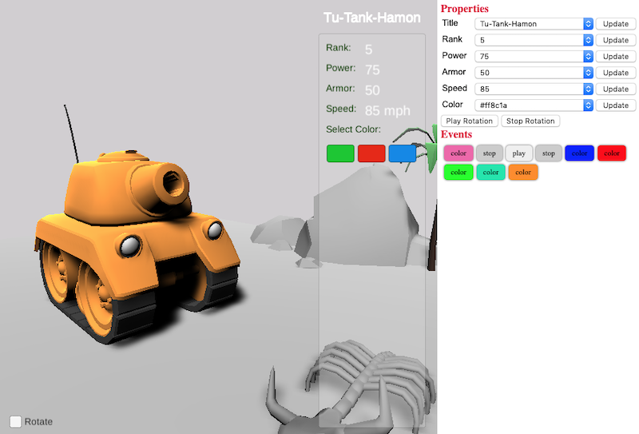

unity-react-sample
================

The React part of this project was bootstrapped with [Next.JS](https://nextjs.org/).

## Objective
This is a sample project to demonstrate a way to communicate between Unity and React. However, this is not an attempt to make a React bindings for Unity WebGL player.

### unity-app
I used the Tank tutorial assets from Unity. I can probably use basic shapes but decided to make life a bit more interesting.

The method I used to achieve my goal is written in the [official documentation](https://docs.unity3d.com/Manual/webgl-interactingwithbrowserscripting.html) from Unity.

In that documentation, you can only invoke methods to Unity player.
```
unityInstance.SendMessage('MyGameObject', 'MyFunction', 'MyString');
```

What I want to demonstrate is a way to call a Unity player function and return a value. I also provided several other functions and events that will be invoked from the Unity content.

#### Methods
```
int GetTankProperty(string property_name)

int GetRank()
void SetRank(int value) // 1-5

int GetPower()
void SetPower(int value) // 0-100

int GetArmor()
void SetArmor(int value) // 0-100

int GetSpeed()
void SetSpeed(int value) // 0-100

void SetTitle(string title)
string GetTitle()

void SetTankColor(string color)
string GetTankColor()

void Play() // rotates tank

void Stop() // stops rotation
```

#### Events
```
OnRotationPlay() // invoked when tank starts to rotate

OnRotationStop() // invoked when tank stopped rotation

OnChangeColor(string newColor) // invoked whenever you change tank color
```

### react-app
The unity content is shown on the left side and you can edit the tank properties using React component on the right side. If you update the a property from the right side panel, it will be shown on the Unity screen. Also events will be recorded in the React app.

I wanted to use input text and input number elements but the keyboard focus is being consumed by the Unity player so I just used dropdown instead.

The unity data is included in react-app/public/data folder.



## react-ap Installation

Go to react folder
```
cd react-app
```

Clone repository and run

```
npm install
```

## Run
Runs the app in the development mode

```
npm run dev
```

Open [http://localhost:3000](http://localhost:3000) to view it in the browser.

The page will reload if you make edits.<br>
You will also see any lint errors in the console.
